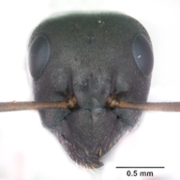

<p align="center">
  
</p>

<h1 align="center">AntWorld.org</h1>

<p align="center">
  <strong>Open Tools for Ant Identification</strong><br>
  Interactive keys + AI-powered visual ID + Open data
</p>

<p align="center">
  <a href="https://antworld.org">Website</a> •
  <a href="#quick-start">Quick Start</a> •
  <a href="#contributing">Contribute</a> •
  <a href="#roadmap">Roadmap</a>
</p>

<p align="center">
  
  
  
  
</p>

---

## The Problem

Ant identification is hard. Really hard.

- **48,600+ articles** on AntWiki — dense, academic, overwhelming for beginners
- **iNaturalist's AI** struggles with ants — generic models miss diagnostic morphology
- **No interactive keys** exist that actually teach you *how* to identify

Researchers dig through PDFs. Students give up. Citizen scientists guess.

## The Solution

**AntWorld bridges the gap.**

We're building the world's first platform that combines:

| Feature | Status |
|---------|--------|
| Interactive dichotomous keys | **Live** — 70+ keys, 936 species |
| AI-powered visual identification | *In development* |
| Progressive learning courses | *Planned* |
| Open API for researchers | *Planned* |
| Expert validation pipeline | *Planned* |

**Our model:** [Xeno-canto](https://xeno-canto.org) did it for bird sounds. We're doing it for ants.

---

## Quick Start

### View the Site

```
https://antworld.org
```

### Run Locally

```bash
# Clone the repo
git clone https://github.com/YOUR_USERNAME/antworld.git
cd antworld

# Start with Podman (or Docker)
podman run -d --name antworld -p 8090:80 \
  -v ./antworld.org:/var/www/html:Z \
  php:8.2-apache

# Enable PHP in .html files
podman exec antworld bash -c "a2enmod rewrite && \
  echo 'AddHandler application/x-httpd-php .html' >> /etc/apache2/conf-available/php-html.conf && \
  a2enconf php-html && \
  sed -i 's/AllowOverride None/AllowOverride All/g' /etc/apache2/apache2.conf && \
  service apache2 reload"

# Open in browser
# Development: http://localhost:8090/alpha/
# Production:  http://localhost:8090/delta/
```

---

## Project Structure

```
antworld/
├── antworld.org/           # The website (deployable)
│   ├── alpha/              # Development version
│   ├── beta/               # Minified, tested on staging
│   └── delta/              # Production-ready
├── scripts/                # Build & deploy workflow
│   ├── minify-to-beta.sh   # Strip comments, minify
│   ├── promote-to-delta.sh # Push to production
│   └── sync-alpha-from-delta.sh
└── README.md
```

**Workflow:** `alpha/` → `beta/` → `delta/` → production server

---

## Contributing

**We need you.** Seriously.

### Roles We're Looking For

| Role | Skills | Impact |
|------|--------|--------|
| **Frontend Dev** | HTML, CSS, JS | Modernize UI, improve mobile experience |
| **Backend Dev** | PHP, Python | Build the API, integrate ML models |
| **ML Engineer** | PyTorch, TensorFlow | Train visual identification models |
| **Myrmecologist** | Ant taxonomy | Validate species data, write keys |
| **Translator** | FR, DE, ES, RU, AR, ZH | Expand to 7+ languages |
| **Designer** | UI/UX, illustration | Icons, diagrams, kids' section |
| **Technical Writer** | Documentation | API docs, tutorials, guides |

### Good First Issues

Look for issues tagged:
- `good-first-issue` — Perfect for newcomers
- `help-wanted` — We're stuck, save us
- `documentation` — No code required

### How to Contribute

1. **Fork** the repo
2. **Create a branch** (`git checkout -b feature/amazing-thing`)
3. **Work in `alpha/`** — never edit `delta/` directly
4. **Test locally** at `http://localhost:8090/alpha/`
5. **Submit a PR** with a clear description

See [CONTRIBUTING.md](CONTRIBUTING.md) for detailed guidelines.

---

## Roadmap

### Phase 1 — Foundation (Current)
- [x] Interactive dichotomous keys (70+ keys)
- [x] Species database (936 species)
- [x] Responsive design
- [ ] Modernize frontend (consolidate jQuery)
- [ ] Set up CI/CD pipeline
- [ ] Public API (read-only)

### Phase 2 — Intelligence
- [ ] Visual identification engine (subfamily → genus)
- [ ] LLM-powered identification guide
- [ ] Photo quality coach
- [ ] Spaced repetition training
- [ ] Nearctic region expansion

### Phase 3 — Platform
- [ ] Expert validation pipeline
- [ ] Full REST API
- [ ] Open ML models (downloadable)
- [ ] Afrotropics & Indomalaya expansion
- [ ] Kids section (coloring pages, games)

### Phase 4 — Global Coverage
- [ ] All biogeographic regions
- [ ] Annual "FormicID" ML challenge
- [ ] DOI-registered citable resource
- [ ] Invasive species alerts

---

## The Ecosystem

We don't replace — we **connect**.

| Platform | Their Role | Our Integration |
|----------|-----------|-----------------|
| [AntWeb](https://antweb.org) | Specimen images | Training data source |
| [AntWiki](https://antwiki.org) | Encyclopedia | Deep links for species |
| [AntMaps](https://antmaps.org) | Distribution maps | Inline maps on species pages |
| [AntCat](https://antcat.org) | Taxonomic catalog | Nomenclatural authority |
| [iNaturalist](https://inaturalist.org) | Citizen science | Share button integration |
| [GBIF](https://gbif.org) | Biodiversity data | Data exchange |

---

## Tech Stack

**Current:**
- Frontend: HTML5, CSS3, jQuery, D3.js, Highcharts
- Backend: PHP 8.x, Apache
- Container: Podman/Docker

**Planned:**
- API: Python FastAPI
- ML: PyTorch
- Database: PostgreSQL + PostGIS

---

## Philosophy

1. **Open by default** — CC for content, open-source for code
2. **Science-first** — Rigorous taxonomy, traceable sources
3. **AI as amplifier** — Experts remain the gold standard
4. **Teach, don't just answer** — Every interaction educates
5. **Connect, don't replace** — Interoperate with the ecosystem
6. **Sustainable without commerce** — No ads, no paywalls, ever

---

## License

- **Content:** [CC BY-NC 4.0](https://creativecommons.org/licenses/by-nc/4.0/)
- **Code:** [MIT License](LICENSE)

---

## Contact

- **Website:** [antworld.org](https://antworld.org)
- **Issues:** [GitHub Issues](https://github.com/YOUR_USERNAME/antworld/issues)

---

<p align="center">
  <i>"Nobody currently occupies the intersection of rigorous key-based identification, AI-assisted visual ID, structured progressive learning, and open data — all without commerce, all open, all connected."</i>
</p>

<p align="center">
  <strong>Be part of building the global reference for myrmecology.</strong>
</p>
